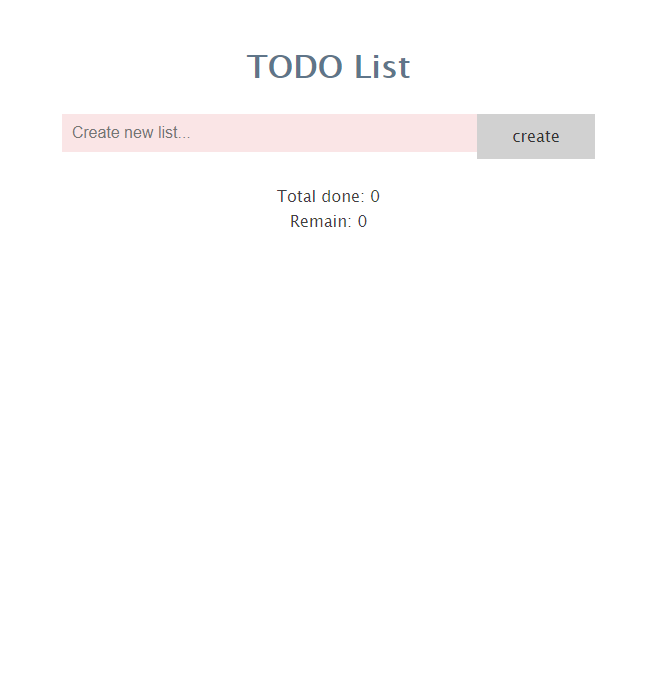
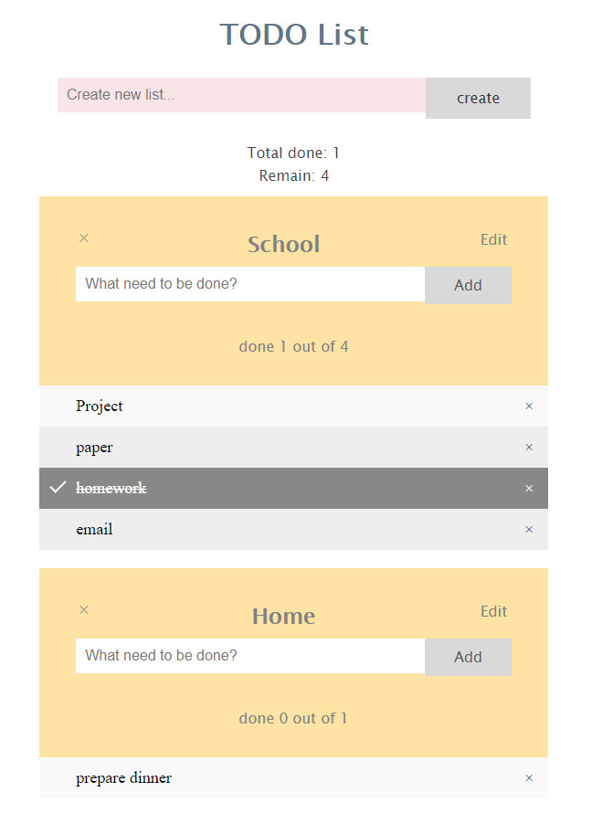
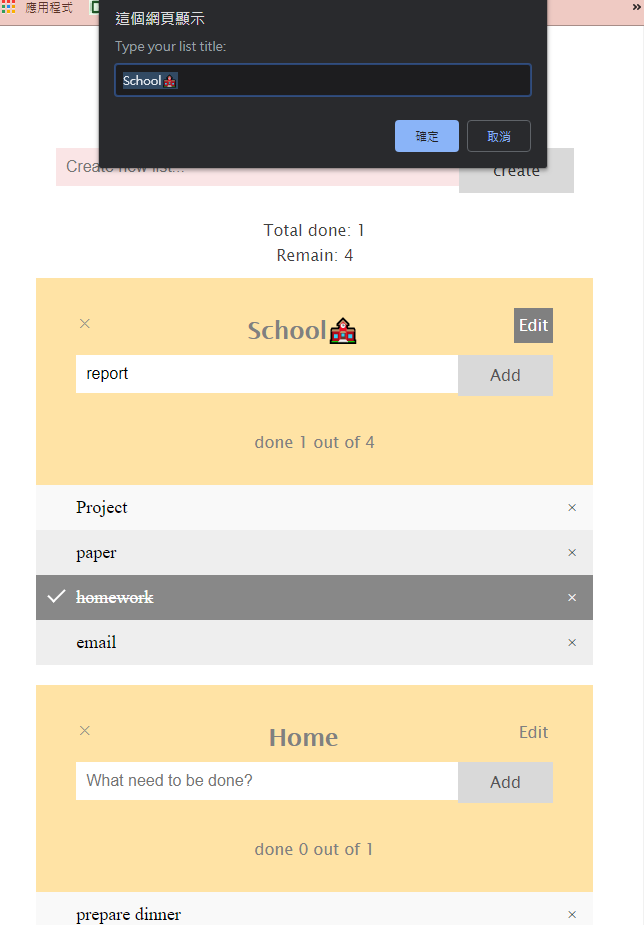

# TODO List
### 2018 March, Class Web Programming assignments.

* based on W3-template.
* pure JS.
* Create multiple todo lists. Each list enables users to add/delete/modify items within it.

## How to use
* Open the .html file in your browser

## Special Features:
* Lists - manage your to-do items more effectively.
* Real-time counter of done/not done
* Support Editing list name
* click for checked/unchecked but not directly delete the item.

## A quick glance at Todolist

Initial page

Create lists and add some items!

Edit list title 

